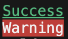
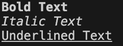
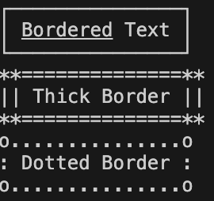
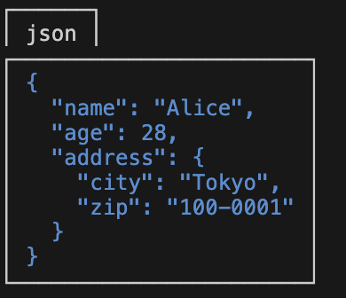

[English](/docs/translations/en/README.md) | [日本語](/docs/translations/ja/README.md)

# Extender Dart


`Extender Dart` is a utility library for Dart developers. It offers a range of commonly used operations and aliases, including extensions for Lists and Maps to perform immutable add, remove, update, and insert operations. Designed to streamline everyday tasks, this library helps prevent accidental in-place modifications.

# Features

- **Common Operations**: Execute frequently-used operations with ease.
- **Alias Collection**: Simplify and accelerate your development with intuitive aliases for various data types, including time-based aliases for `int` and type conversion checks for `String`.
- **List Extensions**: Extend your Lists with immutable operations to prevent accidental in-place modifications.
- **Map Extensions**: Perform immutable operations on your Maps to prevent unintended in-place changes.
- **Sort Operations**: Easily sort your collections in various orders, including by property and with special handling for null values.

# Installation

```yaml
dependencies:
  extender_dart: latest_version

dev_dependencies:
  extender_dart_builder: latest_version
```

Then, run:

```
pub get
```

# Usage

## Aliases

### Int Aliases
These aliases allow you to use integers as durations with great simplicity.

```dart
import 'package:extender_dart/extender_dart.dart';

var fiveMinutes = 5.minutes;  // Equivalent to Duration(minutes: 5)
var twoHours = 2.h;  // Equivalent to Duration(hours: 2)
```
### String Aliases
Make type conversions and validations a breeze with these string aliases.

```dart
import 'package:extender_dart/extender_dart.dart';

var integerValue = "123".toIntOrNull();  // Converts the string to integer, if valid
bool isItDouble = "12.34".isDouble;  // Checks if the string is a valid double representation

var dateTimeValue = "2023-10-12T14:30:00Z".toDateTimeOrNull();  // Converts the string to DateTime, if valid
```

## List Extensions

```dart
import 'package:extender_dart/extender_dart.dart';

var myList = [1, 2, 3];

// Add an element immutably
var extendedList = myList.addWith(4);  // [1, 2, 3, 4]

// Remove an element immutably
var reducedList = myList.removeWith(2);  // [1, 3]

// Insert an element at a specific index immutably
var insertedList = myList.insertWith(1, 10);  // [1, 10, 2, 3]

// Remove an element at a specific index immutably
var removedList = myList.removeAtWith(0);  // [2, 3]

List<Person> people = [
  Person(1, 'Alice'),
  Person(2, 'Bob'),
  Person(1, 'Alice'),
  Person(3, 'Charlie'),
];

// To get a list of unique people by ID:
var uniqueById = people.uniqueBy((p) => p.id);
print(uniqueById); // Will print a list of unique people based on their ID.

// To get a list of unique people by name:
var uniqueByName = people.uniqueBy((p) => p.name);
print(uniqueByName); // Will print a list of unique people based on their name.
```

## Map Extensions
```dart
import 'package:extender_dart/extender_dart.dart';

var myMap = {'a': 1, 'b': 2};

// Add a key-value pair immutably
var extendedMap = myMap.addWith('c', 3);  // {'a': 1, 'b': 2, 'c': 3}

// Add a MapEntry immutably
var extendedWithEntryMap = myMap.addEntryWith(MapEntry('d', 4));  // {'a': 1, 'b': 2, 'd': 4}

// Remove a key-value pair immutably
var reducedMap = myMap.removeWith('a');  // {'b': 2}

// Update a value for a key immutably
var updatedMap = myMap.updateWith('b', (value) => value * 2);  // {'a': 1, 'b': 4}
```

## Sort Operations

`Extender Dart` provides easy-to-use sorting utilities, making it simple to sort your lists in various orders.

### Ascending & Descending

You can easily sort your lists in ascending or descending order.

```dart
import 'package:extender_dart/extender_dart.dart';

List<int> numbers = [1, 3, 5, 4, 2];
numbers.sort(SortOrder.asc);  // [1, 2, 3, 4, 5]
numbers.sort(SortOrder.desc); // [5, 4, 3, 2, 1]
```

### Property Sorting

For more complex types like Maps, you can pick a property to sort by.

```dart
List<Map<String, int>> persons = [
  {"age": 20},
  {"age": 30},
  {"age": 10},
];
persons.sort(SortOrder.pick<Map>((e) => e["age"]).asc);  // [{"age": 10}, {"age": 20}, {"age": 30}]
```

### Handling Nulls

The library also provides utilities for sorting lists that contain null values.

```dart
List<int?> numbersWithNulls = [1, 3, null, null, 2];
numbersWithNulls.sort(SortOrder.nullsFirst); // [null, null, 1, 2, 3]
numbersWithNulls.sort(SortOrder.nullsLast);  // [1, 2, 3, null, null]
```

## Displaying on the Console

`ConsoleText` is a tool designed to display color-coded text in the console during debugging sessions. Below are the features it offers, accompanied by sample code for each.

The `ConsoleText` class can be created by calling the styled method, which is an extension of type `String`.

### Color-coded Text

You can apply various colors to both the text and its background.

**Sample Code**:
```dart
print("Success".styled.green);  // Green text
print("Warning".styled.bgRed.white); // White text with a red background
```



### Text Styling

You can adjust the text's weight and style, including options like bold, italic, and underline.

**Sample Code**:
```dart
print("Bold Text".styled.bold);  // Bold
print("Italic Text".styled.italic);  // Italicized
print("Underlined Text".styled.underline);  // Underlined
```


### Text Bordering

You can emphasize your text by surrounding it with borders.

**Sample Code**:
```dart
print("Bordered Text".styled.bordered());  // With border
print("Thick Border".styled.bordered(style: BorderStyle.thick()));  // With a thick border
print("Dotted Border".styled.bordered(style: BorderStyle.dotted()));  // With a dotted border
```



### Formatted JSON Display

You can format and display JSON data.

**Sample Code**:
```dart
var user = {
  'name': 'Alice',
  'age': 28,
  'address': {'city': 'Tokyo', 'zip': '100-0001'}
};
print(
  "json".styled.bordered(style: BorderStyle.box(enableBottomBorder: false)),
);
print(user.styled.blue.bordered()); // JSON display with a blue border
```



Using this tool, you can display debugging information in a clear and comprehensible manner. It proves especially useful when debugging multiple pieces of information simultaneously or when you need to highlight specific details.


## Automatic Enum Generation for Class Fields

This package provides a powerful code generation capability that allows you to automatically create enum classes that correspond to the fields of your data classes. By simply annotating your data class with `@fieldEnum` or `@freezedFieldEnum`, you can have an enum generated which can be useful for referencing fields in a type-safe manner, such as when working with forms, serialization, or database queries.

### Usage

To use this feature, follow these steps:

1. Annotate your class with `@fieldEnum` to trigger the generation of an enum class that lists all its fields.

    Example:
    ```dart
    // @fieldEnum to annotate and generate UserField enum
    @fieldEnum
    class User {
      String name;
      int age;
      String? email;
      String? phone;

      User({
        required this.name,
        required this.age,
        this.email,
        this.phone,
      });
    }
    // This will generate:
    // enum UserField { name, age, email, phone }
    ```

2. For Freezed classes, use `@freezedFieldEnum` alongside the `@freezed` annotation to achieve the same.

    Example:
    ```dart
    // @freezedFieldEnum to annotate and generate FreezedUserField enum
    @freezed
    @freezedFieldEnum
    class FreezedUser with _$FreezedUser {
      const FreezedUser._();
      const factory FreezedUser({
        required String name,
        required int age,
        required String? email,
        required String? phone,
      }) = _FreezedUser;
    }
    // This will generate:
    // enum FreezedUserField { name, age, email, phone }
    ```

## Contributing

`Extender Dart` is an open-source project and is designed to be extensible. If you have ideas for new type extensions or improvements to existing ones, we warmly welcome your contributions. Not only are bug reports, feature requests, and questions appreciated, but we also encourage you to add extensions for other data types and share them with the community.

## License

[MIT] - see the [LICENSE](LICENSE) file for details.
