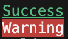
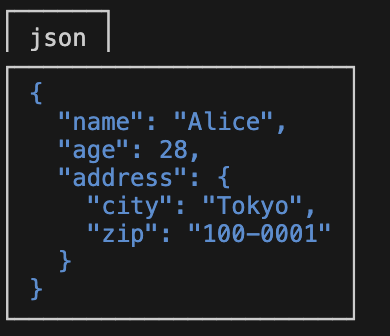

[English](/README.md) | [日本語](/docs/translations/ja/README.md)

# Extender Dart

`Extender Dart`はDart開発者のための便利なユーティリティライブラリです。一般的な操作やエイリアスを提供し、リストやマップの不変の追加、削除、更新、挿入操作が可能です。このライブラリを使用すると、日常のタスクをより効率的に行うことができます。

# 主な機能

- **共通操作の簡略化**: よく使用される操作を簡単に行えます。
- **多彩なエイリアス**: `int`の時間エイリアスや`String`の型変換ヘルパーなど、さまざまなデータ型に対するエイリアスが含まれています。
- **リスト操作の拡張**: リストに対する不変の操作を簡単に行えます。
- **マップ操作の拡張**: マップに対する不変の操作が提供されています。
- **ソートユーティリティ**: null値を含むリストも考慮したソートが簡単に行えます。

# インストール

```yaml
dependencies:
  extender_dart: latest_version
```

その後、

```
pub get
```

を実行してください。

# 使い方

## エイリアス

### Intのエイリアス
整数を期間として扱うためのエイリアスを使用できます。

```dart
import 'package:extender_dart/extender_dart.dart';

var fiveMinutes = 5.minutes;  // Duration(minutes: 5)を返す
var twoHours = 2.h;  // Duration(hours: 2)を返す
```

### Stringのエイリアス
文字列の型変換や検証を簡単に行うためのエイリアスです。

```dart
import 'package:extender_dart/extender_dart.dart';

var integerValue = "123".toIntOrNull();  // 有効な場合に整数に変換
bool isItDouble = "12.34".isDouble;  // 文字列が有効な小数かどうかを確認

var dateTimeValue = "2023-10-12T14:30:00Z".toDateTimeOrNull();  // 有効な場合にDateTimeに変換
```

## リストの拡張

```dart
import 'package:extender_dart/extender_dart.dart';

var myList = [1, 2, 3];

// 要素を不変に追加
var extendedList = myList.addWith(4);  // [1, 2, 3, 4]を返す

// 要素を不変に削除
var reducedList = myList.removeWith(2);  // [1, 3]を返す

// 特定の位置に要素を不変に挿入
var insertedList = myList.insertWith(1, 10);  // [1, 10, 2, 3]を返す

// 特定の位置の要素を不変に削除
var removedList = myList.removeAtWith(0);  // [2, 3]を返す
```

## マップの拡張

```dart
import 'package:extender_dart/extender_dart.dart';

var myMap = {'a': 1, 'b': 2};

// キーと値を不変に追加
var extendedMap = myMap.addWith('c', 3);  // {'a': 1, 'b': 2, 'c': 3}を返す

// MapEntryを不変に追加
var extendedWithEntryMap = myMap.addEntryWith(MapEntry('d', 4));  // {'a': 1, 'b': 2, 'd': 4}を返す

// キーに基づいて要素を不変に削除
var reducedMap = myMap.removeWith('a');  // {'b': 2}を返す

// キーの値を更新
var updatedMap = myMap.updateWith('b', (value) => value * 2);  // {'a': 1, 'b': 4}を返す
```

## ソート操作

`Extender Dart`にはソート操作を簡略化するユーティリティが含まれています。

### 昇順・降順のソート

リストの昇順・降順ソートを簡単に行えます。

```dart
import 'package:extender_dart/extender_dart.dart';

List<int> numbers = [1, 3, 5, 4, 2];
numbers.sort(SortOrder.asc);  // [1, 2, 3, 4, 5]を返す
numbers.sort(SortOrder.desc); // [5, 4, 3, 2, 1]を返す
```

### プロパティに基づくソート

例としてMapでのソートを示します。

```dart
List<Map<String, int>> persons = [
  {"age": 20},
  {"age": 30},
  {"age": 10},
];
persons.sort(SortOrder.pick<Map>((e) => e["age"]).asc);  // [{"age": 10}, {"age": 20}, {"age": 30}]を返す
```

### Nullの処理

null値を考慮したソートが可能です。

```dart
List<int?> numbersWithNulls = [1, 3, null, null, 2];
numbersWithNulls.sort(SortOrder.nullsFirst); // [null, null, 1, 2, 3]を返す
numbersWithNulls.sort(SortOrder.nullsLast);  // [1, 2, 3, null, null]を返す
```

## コンソールへの表示

`ConsoleText`はデバッグの際にコンソールに色付きテキストを表示するためのツールです。以下に各機能とそのサンプルコードを示します。
`ConsoleText`クラスは`String`型のextensionであるstyledメソッドを呼び出すことで作成できます。

### 色付きテキスト

テキストやその背景に様々な色を付けることができます。

**サンプルコード**:
```dart
print("Success".styled.green);  // 緑色のテキスト
print("Warning".styled.bgRed.white); //白のテキスト、赤背景
```



### テキストのスタイリング

テキストの太さやスタイル（イタリックや下線）を変更することができます。

**サンプルコード**:
```dart
print("Bold Text".styled.bold);  // 太字
print("Italic Text".styled.italic);  // イタリック
print("Underlined Text".styled.underline);  // 下線付き
```


### テキストのボーダー

テキストをボーダーで囲んで目立たせることができます。

**サンプルコード**:
```dart
print("Bordered Text".styled.bordered());  // ボーダー付き
print("Thick Border".styled.bordered(style: BorderStyle.thick()));  // 太いボーダー
print("Dotted Border".styled.bordered(style: BorderStyle.dotted()));  // 点線のボーダー
```


### JSONの整形表示

JSONデータを整形して表示することができます。

**サンプルコード**:
```dart
var user = {
  'name': 'Alice',
  'age': 28,
  'address': {'city': 'Tokyo', 'zip': '100-0001'}
};
print(
  "json".styled.bordered(style: BorderStyle.box(enableBottomBorder: false)),
);
print(user.styled.blue.bordered()); // 青色でボーダー付きのJSON表示
```



このツールを使用することで、デバッグ情報を一目でわかりやすく表示することができます。特に複数の情報を同時にデバッグする際や、特定の情報を強調表示する際に非常に便利です。


## クラスフィールドに対応したEnumの自動生成

このパッケージは、データクラスのフィールドに対応したenumクラスを自動的に作成する強力なコード生成機能を提供します。`@fieldEnum`や`@freezedFieldEnum`でデータクラスをアノテートするだけで、型安全な方法でフィールドを参照する際に便利なenumが生成されます。これは、フォーム、シリアライゼーション、データベースクエリを扱う際に特に有用です。

### 使い方

この機能を使用するには、以下の手順に従ってください：

1. クラスに`@fieldEnum`をアノテートして、そのフィールドをすべてリストするenumクラスの生成をトリガーします。

    例：
    ```dart
    // UserField enumを生成するために@fieldEnumをアノテートする
    @fieldEnum
    class User {
      String name;
      int age;
      String? email;
      String? phone;

      User({
        required this.name,
        required this.age,
        this.email,
        this.phone,
      });
    }
    // これにより以下が生成されます：
    // enum UserField { name, age, email, phone }
    ```

2. Freezedクラスに対しては、`@freezedFieldEnum`を`@freezed`アノテーションと一緒に使用します。

    例：
    ```dart
    // FreezedUserField enumを生成するために@freezedFieldEnumをアノテートする
    @freezed
    @freezedFieldEnum
    class FreezedUser with _$FreezedUser {
      const FreezedUser._();
      const factory FreezedUser({
        required String name,
        required int age,
        required String? email,
        required String? phone,
      }) = _FreezedUser;
    }
    // これにより以下が生成されます：
    // enum FreezedUserField { name, age, email, phone }
    ```


## 貢献

`Extender Dart`はオープンソースのプロジェクトです。新しい機能や改善のアイディアがあれば、ぜひご貢献ください。バグレポートや機能リクエストはもちろん、新しいデータ型の拡張を提案してコミュニティと共有することも歓迎します。

## ライセンス

このプロジェクトは[MITライセンス](LICENSE)のもとで公開されています。詳細はLICENSEファイルをご参照ください。